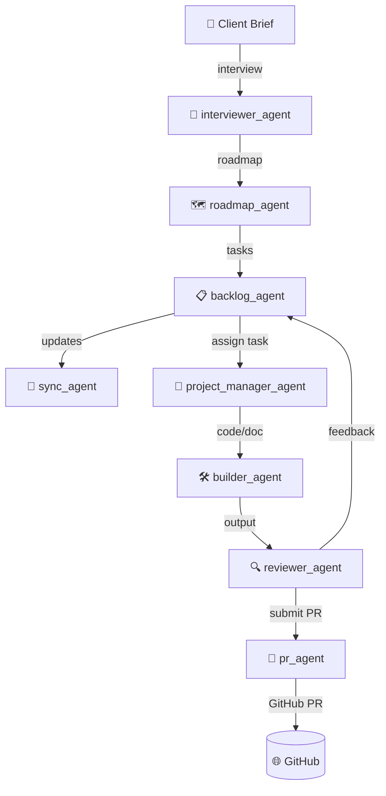

# 📦 Kikon-tai

**Kikon-tai – The Spirit Mechanism Team**

Kikon-tai is a modular, autonomous development framework for AI-led projects. It orchestrates modular agents that work collaboratively to deliver software with a human-in-the-loop approach.

The name *Kikon-tai* (機魂隊) combines the characters for "machine" (機), "soul" (魂), and "team" (隊). It represents a development system driven by autonomous agents with structured coordination and an animating vision.

First mission: build a fully autonomous dev team capable of turning high-level product requirements into a working prototype with minimal client involvement. This project serves as a demonstration of AI-integrated software excellence.

---

## 📁 Project Structure

```
kikon-tai/
│
├── genki_engine/                  # Core task loop and dispatcher
│   └── main_loop.py               # Engine entry point (placeholder)
│
├── agents/                        # Role-based modular agents
│   ├── interviewer_agent/
│   ├── roadmap_agent/
│   ├── backlog_agent/
│   └── sync_agent/
│
├── configs/                       # Agent role configs and global settings
│   ├── role_configs.yaml          # Clean version only (no Misama)
│   ├── tone_guidelines.yaml       # Style guidance for outputs
│   └── schedule.yaml              # Optional future: CRON-style agent triggers
│
├── prompts/                       # Modular prompts per agent
│   └── [agent_name].txt
│
├── data/                          # Generated output from loop execution
│   ├── requirements.yaml
│   ├── roadmap.md
│   ├── backlog.yaml
│   └── sprint_log/
│       └── 2025-05-23.md
│
├── client_portal/                 # Where user inputs, desires, and interview data go
│   └── client_brief.md
│
└── README.md                      # Overview of the Kikon-tai framework
```

---

## 🧭 Vision

Kikon-tai is an autonomous, full-service design and development organization. Its purpose is to:
- Accept high-level product briefs from a human client.
- Break them down into deliverable roadmaps and tasks.
- Coordinate agent-based development to build working prototypes.
- Iterate based on client feedback.

It is intended as both a usable infrastructure and a demonstration project for job applications. While capable of expressive, emotionally intelligent interaction when enabled, Kikon-tai defaults to a professional tone for external use.

Kikon-tai is:
- Modular and open source, suitable for both public and internal applications
- A scaffold for AI-assisted development workflows
- A blueprint for human-AI collaboration, balancing autonomy and oversight
- A portfolio project demonstrating applied AI architecture and team orchestration

## 🚀 Quickstart

```bash
git clone https://github.com/katruje/kikon-tai.git
cd kikon-tai
python3 -m venv .venv
source .venv/bin/activate
pip install -r requirements.txt
python -m genki_engine.main_loop
```

## ✨ Features

- Modular agent-based design
- Autonomous task execution with human-in-the-loop supervision
- Dynamic backlog and roadmap generation
- GitHub PR integration for autonomous project delivery
- Built-in review and build scaffolding

---


## 🧠 Agent Architecture

Kikon-tai uses a modular, layered design where each agent is responsible for a distinct function in the autonomous development loop:

- `interviewer_agent`: Conducts structured interviews to gather goals and context from the human user.
- `roadmap_agent`: Converts client input into a phased roadmap.
- `backlog_agent`: Breaks down the roadmap into discrete tasks.
- `sync_agent`: Merges progress from internal and external sources to keep the backlog up to date.
- `project_manager_agent`: Oversees multi-agent coordination, handles task routing, and ensures overall progress toward delivery goals.
- `builder_agent`: Generates code or documentation based on tasks.
- `reviewer_agent`: Analyzes outputs for quality, consistency, and correctness.
- `pr_agent`: Submits work as GitHub pull requests, optionally tagging the human-in-the-loop for review.

All agents are coordinated by the `genki_engine`, which loops through the backlog and delegates tasks to agents as needed.



## 🛠️ Development Notes

- Add new agents in `agents/[agent_name]/` with a handler in `[agent_name].py`
- Use `configs/role_configs.yaml` to define behavior and constraints for each role
- Prompts for each agent live in the `prompts/` directory
- Use `python -m genki_engine.main_loop` to simulate a full execution cycle

© 2025 James Laframboise. Released under the [MIT License](LICENSE).