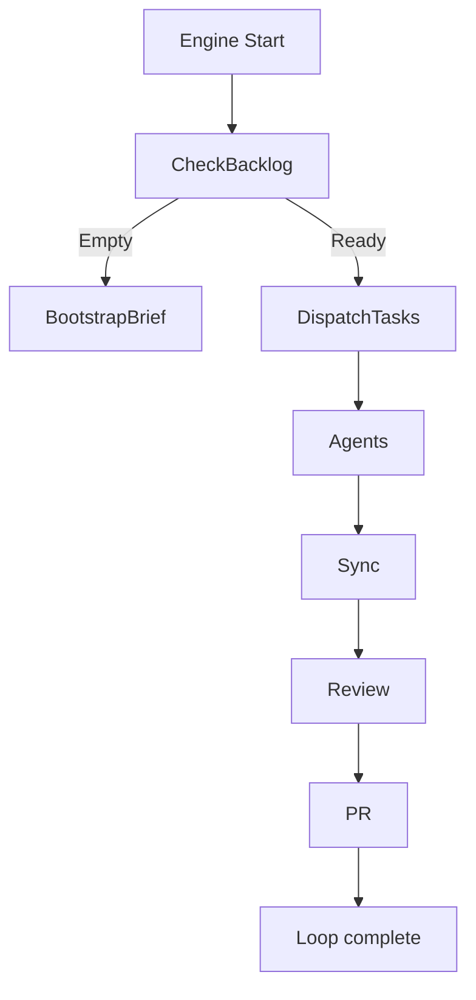

# Execution Workflow

Kikon-tai operates in an autonomous loop via `genki_engine/main_loop.py`. The typical flow is:

1. **Load backlog**
   - If empty, bootstrap from client brief.
2. **Dispatch tasks**
   - Tasks assigned to agents based on `assigned_to` field.
3. **Agent execution**
   - Each agent processes its task using logic defined in its `handle()` method.
4. **Sync + review**
   - Backlog and logs are synced; reviewer_agent may analyze output and queue follow-ups.
5. **Pull request submission**
   - `pr_agent` submits results as a PR to the client project repo.

## Visual Diagram

